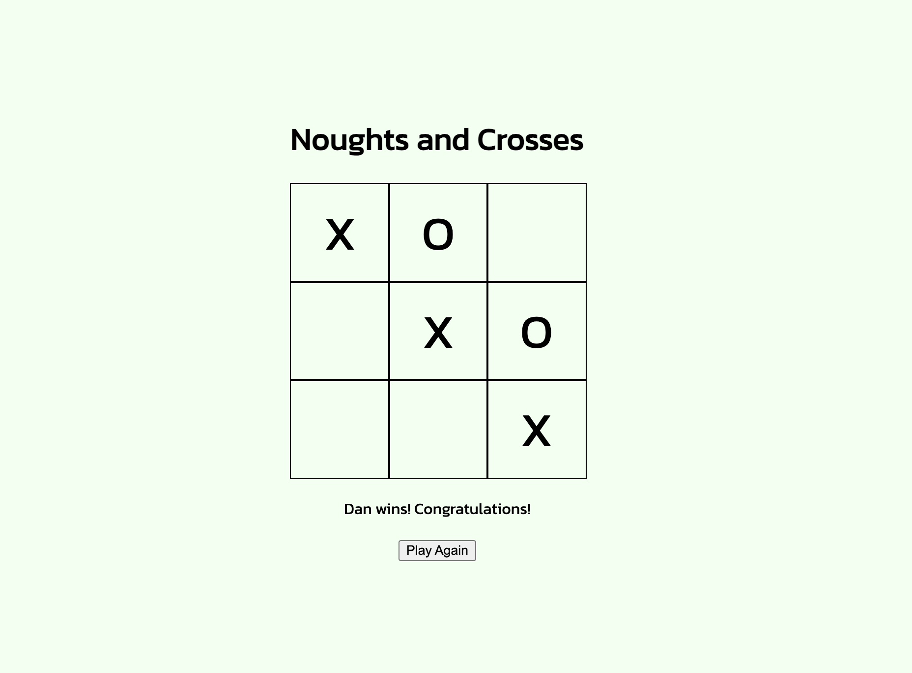

# Rock, Paper, Scissors

  ## Description
  This application allows you to play a game of Noughts and Crosses (Tic-Tac-Toe) against a friend in the browser.  Take it in turns to make your moves and the app will let you know who wins.

  The app uses JS to create players, control the game board and manage the conditions for the end of the game.

  

  ## Contents
   - [Installation](#Installation)
   - [Usage](#Usage)
   - [License](#License)
   - [Contributions](#Contributions)
   - [Testing](#Testing)
   - [Questions](#Questions)

  ## Installation
  N/A - game runs in the browser.
  
  ## Usage
  Open the page in the browser.  Enter the player names and play the game by clicking the squares you wish to add your move to, alternating with your opponent.  Once the game has ended, the outcome will be displayed and the game can be re-started.

  
  
  ## License
  None

  ## Contributing
  If you wish to contribute, get in touch or open an issue on my page.

  ## Testing
  N/A

  ## Questions
  If you have any questions, reach out to me at danwhitlock@hotmail.co.uk or open an issue on my github page: https://github.com/danwhitlock.
